# WindLab user guide

WindLab is a design and manufacturing suite for filament-wound **composite overwrapped pressure vessels
(COPVs)**. It covers the liner geometry, materials, layup, structural analysis, correlation with tests, the
winding machine and G-code output, all from one web UI (or the command line).

This guide is for the people who use WindLab to design vessels and prepare them for the winding machine. It
describes what the UI actually does, field by field, and walks through the common tasks. For the equations
behind the models see the [documentation index](README.md). For the HTTP interface see [API.md](API.md).
For what has been validated and how well it agrees, see [VALIDATION.md](VALIDATION.md).

> **Safety.** WindLab is a preliminary design and process-planning tool. Its predictions of burst, fatigue,
> stress rupture, cure and permeation use datasheet or generic material data and simplified models. They
> **must be calibrated against tests** on your materials and process before a design is released.
> **Pressure testing is hazardous:** a bursting vessel releases its stored energy violently. Test only in a
> barricaded cell with remote operation, follow the applicable standard and your site's safety rules, and
> never pressurise hardware on the strength of a WindLab result alone. **Always dry-run new G-code** (no fibre,
> no mandrel, feed override low) and check the axis directions and offsets before winding.

---

## Contents

1. [What WindLab does](#1-what-windlab-does)
2. [Installing and starting WindLab](#2-installing-and-starting-windlab)
3. [A tour of the user interface](#3-a-tour-of-the-user-interface)
4. [The nine steps in detail](#4-the-nine-steps-in-detail)
   - [4.1 Vessel](#41-vessel)
   - [4.2 Materials](#42-materials)
   - [4.3 Layup](#43-layup)
   - [4.4 Thickness](#44-thickness)
   - [4.5 Analysis](#45-analysis)
   - [4.6 Testing](#46-testing)
   - [4.7 Machine](#47-machine)
   - [4.8 Simulate](#48-simulate)
   - [4.9 Export](#49-export)
5. [Workflows](#5-workflows)
   - [5.1 Design a Type III vessel from scratch](#51-design-a-type-iii-vessel-from-scratch)
   - [5.2 Design a Type IV hydrogen vessel](#52-design-a-type-iv-hydrogen-vessel)
   - [5.3 Set up a machine and generate G-code (LinuxCNC and GRBL)](#53-set-up-a-machine-and-generate-g-code-linuxcnc-and-grbl)
   - [5.4 Continuous winding](#54-continuous-winding)
   - [5.5 Choosing a cure cycle](#55-choosing-a-cure-cycle)
   - [5.6 Correlating burst tests (calibration)](#56-correlating-burst-tests-calibration)
   - [5.7 Exporting to CalculiX and comparing](#57-exporting-to-calculix-and-comparing)
6. [Understanding the checks](#6-understanding-the-checks)
7. [Command line and HTTP API](#7-command-line-and-http-api)
8. [Troubleshooting and FAQ](#8-troubleshooting-and-faq)
9. [Glossary](#9-glossary)

**Units used throughout:** lengths in mm, pressures and stresses in MPa (the UI also shows bar), angles in
degrees, temperatures in °C, time in s or min, mass in g or kg. The winding angle is measured from the vessel
axis. End A of the vessel is at negative z, end B at positive z, and z = 0 is the middle of the cylinder.

---

## 1. What WindLab does

### Vessels

| Vessel type | Liner | What WindLab checks for the liner |
|---|---|---|
| **Type III** | Metal (built-in: aluminium 6061-T6 / -T62, 7075-T73, Ti-6Al-4V, stainless 316L) | Autofrettage window, reverse yield, elastic at MEOP and proof, fatigue life, leak-before-burst, temperature during cure |
| **Type IV** | Polymer (built-in: HDPE, PA6) | No autofrettage. Liner strain at proof, liner temperature during cure, service temperature, H₂ permeation, internal support pressure needed while winding |

The liner type follows from the liner material: pick a polymer liner and the whole UI switches to Type IV
(the badge next to the liner material says which type applies).

Domes can be **isotensoid** (geodesic-isotensoid), **hemispherical** or **elliptical**. Ends A and B can have
different boss (polar opening) radii.

### Design and analysis

- Layer-by-layer build-up: each layer is wound on the surface left by the previous one. Helical layers can be
  **geodesic** or **non-geodesic** (friction-steered), hoop layers can have overlap and drop-offs.
- A **pattern closure solver** picks a closing winding pattern for each helical layer; you can request a
  pattern style (large diamonds to fine mosaic) or pin a pattern.
- Band-level **thickness simulation** (gaps, overlaps, polar build-up).
- Structural analysis of the cylinder (elastic-plastic liner plus laminate, thermal strains), an
  axisymmetric **shell finite-element** model of the whole vessel, and an on-demand **progressive failure**
  analysis ramped to burst.
- **Stress-rupture reliability**, **oven cure simulation**, **burst scatter** (statistical margin), winding
  **tension schedule**, **fibre bridging** detection, predicted **water-jacket expansion**.
- **Suggest layup** (sizes a layup to the checks), **Optimise mass**, and **calibration** against test
  records.

### Manufacturing

- Machines with **2 axes** (mandrel and carriage, eye at a fixed radius), **3 axes** (adds crossfeed) or
  **4 axes** (adds payout-eye rotation).
- Controllers: **LinuxCNC** (`.ngc`) and **GRBL / grblHAL** (`.gcode`). Any axis letter, scale and direction.
- **Continuous winding** (the roving is never cut) with planned transitions between layers.
- Machine simulation with playback, G-code verification and backplot.
- Shop-floor **traveller**, printable **design report**, **Abaqus** and **CalculiX** FE exports.

---

## 2. Installing and starting WindLab

WindLab has two parts: a Python backend (FastAPI) that does all the computation, and a React web UI. In
production the backend also serves the built UI, so you only run one process.

### 2.1 Requirements

- Python 3.10 or later.
- Node.js 18 or later (only to build or develop the UI).
- Optional: CalculiX (`ccx` on the `PATH`) to run the CalculiX comparison from the command line.

### 2.2 Install the backend

```bash
cd backend
pip install -e ".[dev]"      # or, from the repository root: pip install -e backend
```

This installs the `windlab` command. The `dev` extra adds `pytest` and `httpx` for the test suite
(`pytest` in `backend/` runs it).

### 2.3 Build the web UI

```bash
cd frontend
npm install
npm run build                # type-checks and builds into frontend/dist
```

### 2.4 Start WindLab

```bash
windlab serve                # http://127.0.0.1:8000
windlab serve --host 0.0.0.0 --port 8080
```

Open the address in a browser (a current Chrome, Edge or Firefox with WebGL for the 3D view).
`windlab serve` serves the UI from `frontend/dist` when that folder exists. The API is under `/api`.

The server has no user accounts or authentication. Keep it on `127.0.0.1` or on a network you trust.

**Environment variables**

| Variable | Default | Meaning |
|---|---|---|
| `WINDLAB_PROJECTS` | `~/.windlab/projects` | Folder where **Save** stores projects on the server (one `<name>.json` per project) |
| `WINDLAB_WEB` | `frontend/dist` of the repository | Folder with the built web UI that `windlab serve` serves at `/` |

Example: `WINDLAB_PROJECTS=/srv/windlab/projects windlab serve --host 0.0.0.0`.

### 2.5 Development mode (UI with hot reload)

```bash
# terminal 1: backend on port 8000
cd backend && windlab serve          # or: python3 -m uvicorn windlab.api:app --port 8000

# terminal 2: Vite dev server
cd frontend && npm run dev           # http://localhost:5173, proxies /api to 127.0.0.1:8000
```

### 2.6 Projects: saving, loading and the examples

A project is a single JSON document (liner, requirements, materials, layers, machine, continuous-winding
settings, test records and notes). There are four ways to keep it:

| Where | How | Notes |
|---|---|---|
| Browser (automatic) | Every change is saved to the browser's local storage | The project reappears when you reload the page, in the same browser only |
| Server | **Save** in the top bar (or Ctrl+S) | Uses the project name as the file name. Names must start with a letter or digit and may contain letters, digits, spaces, `_`, `.` and `-` (up to 100 characters). Saving under an existing name overwrites it |
| JSON file | **Export** in the top bar | Downloads `<project name>.json`. Use it with the command line, or to archive a design |
| Opening | **Open** in the top bar | Lists the projects on the server (newest first; the bin icon deletes one after confirmation) and has **Import JSON file…** |

**New** starts a fresh project (default aluminium liner, T700S / epoxy, a two-layer layup, the default
4-axis LinuxCNC machine) after a confirmation. **New**, **Open**, **Import** and loading an example can all be
undone with Ctrl+Z.

**Examples.** The **Examples…** menu in the top bar loads a sized example project (after a confirmation):

| Example | What it shows |
|---|---|
| Type III, 30 MPa, 11.5 L, isotensoid domes, T700S (LinuxCNC 4-axis) | A typical Type III cylinder; many layers, staggered hoops |
| Type III, 70 MPa, 2 L, hemispherical domes, T800S (LinuxCNC 4-axis) | A thick, high-pressure laminate with a slow, stepped cure cycle |
| Type III, 25 MPa, 6 L, unequal openings, non-geodesic helicals (LinuxCNC 4-axis) | Different boss radii at A and B with friction-steered helicals |
| Type IV hydrogen, 35 MPa NWP, 17 L, HDPE liner (LinuxCNC 4-axis) | Polymer liner: low-temperature resin and cure, permeation, support pressure |
| Desktop demo, 10 MPa, 1 L, elliptical domes (GRBL 3-axis) | A small, fast project for trying features (progressive failure in about 20 s) |

The examples are a good starting point: load the one closest to your vessel and edit it.

---

## 3. A tour of the user interface

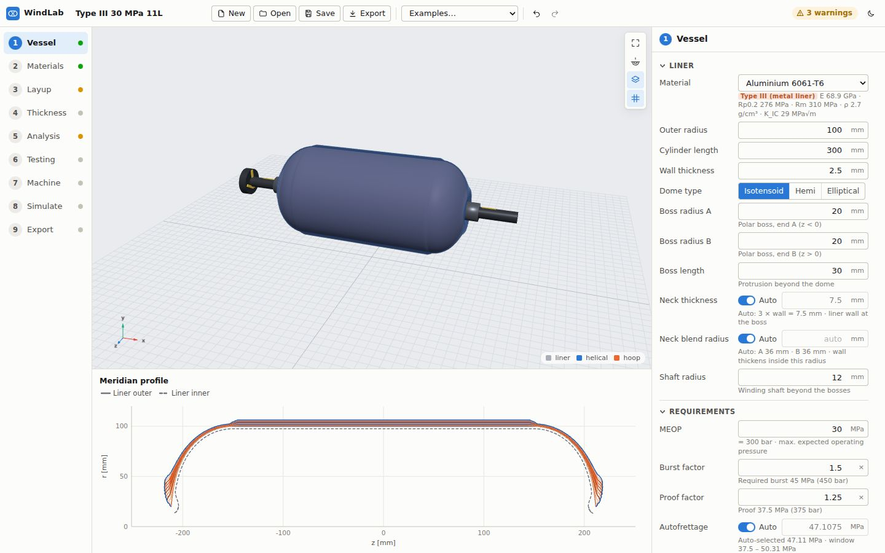

*The Vessel step of the 30 MPa Type III example. Left: the stepper with a status dot per step. Centre: the 3D
view with its toolbar (top right) and, below it, the step's charts. Right: the properties panel.*

### 3.1 Top bar

From left to right:

- **Project name**: click to edit. It is used for **Save** and for downloaded file names.
- **New**, **Open**, **Save**, **Export**: see [2.6](#26-projects-saving-loading-and-the-examples).
- **Examples…**: load an example project.
- **Undo** / **Redo** arrows (Ctrl+Z, Ctrl+Shift+Z or Ctrl+Y). Up to 200 steps. Repeated edits of the same
  field within a second (for example dragging a slider) count as one step. While a plain text field has the
  focus, Ctrl+Z undoes typing in that field instead.
- A short confirmation message after save/open/load actions.
- **Analysing** spinner while a new analysis is running.
- **Status pill**: *All checks OK* (green), *N warnings* (amber), *N fail* (red) or *Not analysed*. Hover
  over it for the counts.
- **Theme** button (sun/moon): switches between light and dark. The first time, WindLab follows your
  operating system; your choice is remembered in the browser.

### 3.2 Stepper and status dots

The nine steps are listed on the left: **1 Vessel, 2 Materials, 3 Layup, 4 Thickness, 5 Analysis, 6 Testing,
7 Machine, 8 Simulate, 9 Export**. Click a step or press **Alt+1 … Alt+9**. The steps are not a wizard: you can
jump to any step at any time, and everything is recomputed from the current project.

Each step has a status dot: green (ok), amber (warning), red (failure), grey (not evaluated). The dots come
from the design checks, which are routed to the step where you fix them:

| Step | Dot shows |
|---|---|
| Vessel | Liner, geometry, autofrettage and fatigue checks (`geo.*`, `liner.*`, `af.*`, `fatigue`) |
| Materials | Cure checks (`cure.*`) |
| Layup | Layer, layup, tension, dome and pattern checks, including `liner.support` (Type IV); amber if a layer has warnings |
| Thickness | The last band simulation: amber on warnings, gaps above 0.5 %, overlaps above 5 % or missing cells; grey until you run one |
| Analysis | The worst of **all** checks |
| Machine | The last simulation: red if machine limits are exceeded; grey until you simulate |
| Simulate | The last simulation: red if limits are exceeded, amber if it has warnings |
| Testing, Export | No dot |

### 3.3 How analysis runs

WindLab re-analyses the project automatically **0.4 s after your last change**; you never press a
"calculate" button for the main analysis. While it runs, a spinner shows in the top bar, in the panel header
and as *computing* in the 3D view. If the backend rejects the design (for example an impossible turnaround
radius), a red **Analysis failed** banner shows the reason above the 3D view, with **Retry**, and the last
valid result stays on screen.

Some calculations are slower and run only on request: the band thickness map, progressive failure, burst
scatter, cure-cycle suggestion, suggest layup, optimise mass, continuous-winding plan, simulation and the
exports. Their results say *Re-run (project changed)* or *Computed for an earlier version of the project*
when you have edited the project since.

### 3.4 3D view

- **Rotate**: drag with the left mouse button. **Pan**: drag with the right mouse button (or use the arrow
  keys after clicking the view). **Zoom**: mouse wheel.
- Toolbar (top right of the view):
  - **Fit to view**.
  - **Section view**: cuts the vessel in half and shows the liner wall and every layer in cross-section.
  - **Show composite layers**: hide the layers to see the liner.
  - **Show grid**.
- The axis triad is in the bottom-left corner, the colour legend (liner, helical, hoop) in the bottom right.
- What the view shows depends on the step: the selected layer is highlighted on the Layup step, the thickness
  map is painted on the surface on the Thickness step, FE results on the Analysis step, transition paths on
  the Machine step and the machine with the fibre path on the Simulate step.

### 3.5 Properties panel

The panel on the right holds the inputs and results of the current step, in collapsible sections (click a
section title). Conventions:

- **Number fields** commit on **Enter** or when you leave the field; **Esc** reverts. **↑/↓** step the value
  (**Shift** ×10, **Alt** ×0.1). Both `.` and `,` work as the decimal separator, and simple arithmetic such
  as `300/2` is accepted. Out-of-range values are flagged in red and not applied.
- **Auto** switches: many fields have an automatic value. With *Auto* on, the field shows the computed value
  greyed out; switch it off to enter your own.
- Hints under each field explain it and often show derived values (for example the required burst pressure
  in MPa and bar).
- **Checks lists** show each check with a status icon, label, detail, and value / limit. Checks that refer
  to layers show layer chips: clicking the row or a chip jumps to that layer on the Layup step.

### 3.6 Chart area

Most steps show charts below the 3D view. Hover over a chart to read values. Click a legend entry to hide or
show that series. Buttons in a chart's top-right corner switch what it plots (for example *Stacked / Per
layer / Total*). The chart area scrolls when there are more charts than fit.

---

## 4. The nine steps in detail

### 4.1 Vessel

The liner geometry and the requirements. The chart below the 3D view is the **meridian profile**: liner
outer and inner surface and the outer surface after each layer (see the screenshot in
[section 3](#3-a-tour-of-the-user-interface)).

#### Liner

| Field | Meaning | Typical values |
|---|---|---|
| **Material** | Liner material from the library (built-in or custom). The badge shows *Type III (metal liner)* or *Type IV (polymer liner)* and the hint lists the key properties | AA6061-T6 for Type III, HDPE or PA6 for Type IV |
| **Outer radius** | Outer radius of the liner cylinder | 50 – 110 mm in the examples |
| **Cylinder length** | Length of the cylindrical part (0 = spherical vessel) | 120 – 400 mm |
| **Wall thickness** | Liner wall in the cylinder | 1.5 – 3 mm aluminium, about 5 mm HDPE |
| **Dome type** | *Isotensoid*, *Hemi* (hemispherical) or *Elliptical*. Isotensoid domes need a boss radius below 0.6 × the cylinder radius | Isotensoid for best fibre use |
| **Dome aspect** | Elliptical domes only: dome height / cylinder radius (0.2 – 1.5) | 0.6 – 0.7 |
| **Boss radius A / B** | Outer radius of the polar boss at each end | 10 – 24 mm |
| **Boss length** | How far the boss protrudes beyond the dome | 20 – 30 mm |
| **Neck thickness** | Liner wall at the boss. *Auto* = 3 × wall | Auto |
| **Neck blend radius** | Radius inside which the wall thickens towards the boss (both ends). *Auto* shows the value for A and B | Auto |
| **Shaft radius** | Winding shaft beyond the bosses (used for clearance of the eye and free fibre) | 6 – 12 mm |

If A and B have different boss radii and a helical layer is geodesic, an **Unequal polar openings** banner
explains that geodesic helicals turn at the larger boss radius at both ends. **Switch helicals to
non-geodesic** changes all helical layers in one undoable step.

#### Requirements

| Field | Meaning | Typical values |
|---|---|---|
| **MEOP** | Maximum expected operating pressure (also shown in bar) | 10 – 70 MPa. For hydrogen, MEOP = 1.25 × NWP |
| **Burst factor** | Required burst / MEOP; the hint shows the required burst pressure | 1.5 – 3.0 (standard dependent) |
| **Proof factor** | Proof / MEOP; the hint shows the proof pressure | 1.25 – 1.5 |
| **Autofrettage** (Type III) | Pressure that yields the liner to leave it in compression. *Auto* picks it inside the feasible window; the hint shows the value and the window | Auto |
| **Autofrettage** (Type IV) | Shows *None (Type IV)*: the first load is the proof test | – |
| **Stress ratio limit** | Maximum fibre stress at MEOP / fibre strength (stress-rupture criterion) | 0.6 default |
| **Design cycles** | Required MEOP pressure cycles | 500 – 11 000 |
| **Fatigue scatter factor** | The liner must reach cycles × factor | 4 |
| **Operating temp.** | Minimum and maximum service temperature. Stress ratios and liner stress are checked at MEOP at both ends | −40 to 65 °C (85 °C for H₂ tanks) |
| **Ambient (test)** | Temperature of autofrettage and proof. The hint also shows the cure (stress-free) temperature set on the Materials step | 20 °C |

#### Stress rupture (collapsed by default)

| Field | Meaning | Typical |
|---|---|---|
| **Service life** | Years used by the stress-rupture reliability | 15 years |
| **Time at MEOP** | Share of the life spent at MEOP (the rest unpressurised) | 100 % (conservative) |
| **Target Pf** | Allowed stress-rupture failure probability over the life | 1e-6 |
| **Hold time** | Hold at the autofrettage and proof pressures (Type IV: proof only). Surviving the hold earns reliability credit | 60 s |

#### Permeation (Type IV)

Opens automatically for polymer liners; for a metal liner it says it does not apply.

| Field | Meaning | Typical |
|---|---|---|
| **Permeation limit** | Allowed steady-state H₂ permeation at MEOP per litre of water capacity | 46 NmL/h/L |
| **Permeation temp.** | Temperature of the permeation test | 55 °C |

#### Notes

Free text saved with the project (applied when you leave the box).

The **Vessel checks** list at the bottom shows the liner, geometry, autofrettage and fatigue checks.

### 4.2 Materials

Fibre, resin, composite properties and the cure cycle. Below the 3D view is the **materials library**.

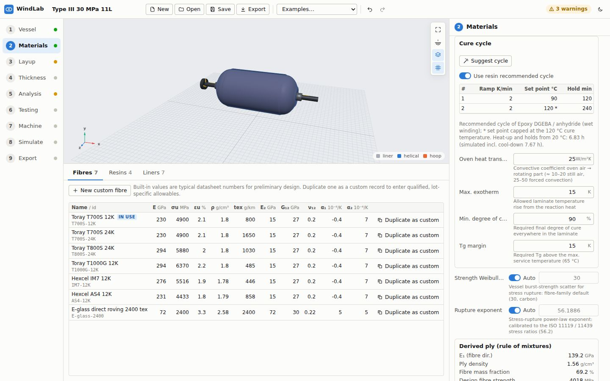

*Materials step, scrolled to the cure cycle. The recommended cycle of the resin is used (set point 120 °C is
capped at the cure temperature, marked \*). Below the 3D view: the fibre library with "Duplicate as custom".*

#### Fibre and Resin

- **Fibre**: choose from the library. The card shows modulus, strength, elongation, density, linear density
  (tex) and thermal expansion. If some layers override the fibre (see [4.3](#43-layup)), they are listed here.
- **Resin**: the card shows modulus, Poisson ratio, density, CTE, the final cure (stress-free) temperature
  and the typical cure.

Built-in fibres: Toray T700S 12K / 24K, T800S 24K, T1000G 12K, Hexcel IM7 12K, AS4 12K, E-glass 2400 tex.
Built-in resins: Epoxy DGEBA / anhydride (wet winding), toughened epoxy (towpreg), high-Tg epoxy / amine,
low-temperature epoxy / amine (for Type IV liners).

#### Composite

| Field | Meaning | Typical |
|---|---|---|
| **Fibre volume fraction** (slider) | Cured Vf (valid 0.3 – 0.8) | 0.55 – 0.65 (0.60 default) |
| **Translation efficiency** (slider) | Fraction of the fibre strength realised in the vessel. Calibrate it from burst tests ([4.6](#46-testing)) | 0.8 – 0.9 (0.82 default) |
| **Cure temperature** | Stress-free temperature of the liner/composite bond. Cooling from it to the ambient temperature sets thermal residual stresses. If it differs from the resin's final cure temperature, a **use … °C** link sets it | The final hold of your cure cycle |
| **Strength Weibull shape** | Scatter of the vessel burst strength for stress rupture. *Auto* uses the fibre-family default (shown in the hint) | Auto (30 for carbon) |
| **Rupture exponent** | Power-law exponent of the stress-rupture model. *Auto* calibrates it to the ISO 11119 / 11439 stress ratios | Auto |

The **Derived ply (rule of mixtures)** card shows E₁, ply density, fibre mass fraction, design fibre
strength (strength × efficiency) and the ply's axial CTE.

#### Cure cycle

- **Use resin recommended cycle** (on): uses the resin's cycle; set points above the cure temperature are
  capped at it and marked `*`.
- Switch it off to **edit your own cycle**: a table of steps with **Ramp** (K/min), **Set point** (°C) and
  **Hold** (min), a bin icon per step and **Add step**.
- **Suggest cycle**: searches for the shortest cycle that meets the exotherm, degree-of-cure, Tg and liner
  temperature limits (up to about a minute). It replaces the project cycle, sets the cure temperature to the
  final hold and shows notes.
- The text under the table gives the heat-up plus hold time from the ambient temperature and, once
  analysed, the simulated duration including cool-down. It warns when the highest set point differs from the
  cure (stress-free) temperature.
- **Oven heat transfer**: convective coefficient from the oven air to the rotating part (about 10 – 20 W/m²K in
  still air, 25 – 50 with forced convection; 25 default).
- **Max. exotherm**: allowed laminate temperature rise from the reaction heat (15 K default).
- **Min. degree of cure**: required everywhere in the laminate (90 % default).
- **Tg margin**: required Tg above the maximum service temperature (15 K default).

The results of the cure simulation are on the Analysis step ([4.5](#45-analysis)); the **Material checks**
list at the bottom of this panel shows the cure checks.

#### Materials library (below the 3D view)

Tabs **Fibres**, **Resins**, **Liners** (with the number of records and of custom records). The table lists
every record with its main properties. Badges: *in use*, *custom*, *overridden* (a custom record with the
same id takes precedence), *Type IV* for polymer liners.

- Built-in rows: **Duplicate as custom** opens the editor with a copy.
- Custom rows: **Edit**, **Duplicate**, **Delete** (Delete is blocked while the record is used and no
  built-in with the same id would take over).
- **New custom fibre / resin / liner material** opens an empty editor.

The editor has **Id**, **Name**, all numeric properties, and:

- fibres: **Filaments** (e.g. 12K), transverse and shear moduli, Poisson ratio, axial and transverse CTE;
- resins: a **Cure kinetics (DSC)** group (Kamal–Sourour A₁, E₁, A₂, E₂, m, n, heat of reaction, Tg uncured
  and fully cured, DiBenedetto λ) and the resin's **Recommended cure cycle** table;
- liners: **Liner type** (*Metal (Type III)* or *Polymer (Type IV)*), yield, ultimate, elongation, fatigue
  coefficient and exponent (Basquin), CTE, K_IC, thermal conductivity and specific heat; polymer liners also
  **Max. temperature**, **Strain limit**, **H₂ permeability** and **Permeation activation energy**.

Custom materials are saved with the project. Renaming a custom record's id updates the references to it.
Use qualified, lot-specific values: the built-in numbers are typical datasheet values for preliminary design.

### 4.3 Layup

The layer stack, each layer's winding parameters and pattern, and the winding tension schedule.

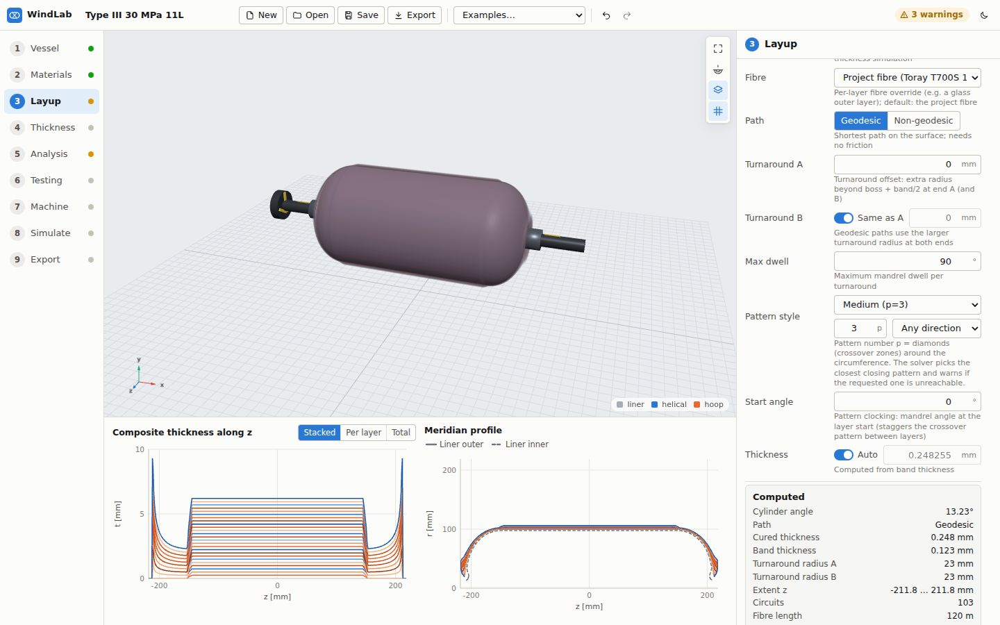

*Layup step of the 30 MPa example, helical layer selected, pattern style "Medium (p=3)". Below the 3D view:
composite thickness along z (stacked per layer) and the meridian profile.*

#### Toolbar

- **+ Helical**, **+ Hoop**: insert a new layer after the selected one.
- **Suggest layup**: asks the backend for a layup that meets the requirements. See below.
- **verify with progressive failure**: tick before *Suggest layup* to also verify the suggestion with the
  progressive failure analysis and add layers until it passes (several minutes).
- **Optimise mass**: see below.

#### Layer table

Columns: **#**, **Layer** (colour, id, badge **X** helical / **H** hoop, **NG** for non-geodesic, a fibre
badge such as *glass* for a fibre override, and a warning mark if the layer has warnings or a failing
sub-check), **Angle** (cylinder winding angle), **t mm** (cured thickness in the cylinder), **Circ**
(circuits), and up/down arrows. The footer shows the total mass, winding time and thickness.

- Click a row to select the layer.
- Reorder with the arrows, by dragging a row, or with **Alt+↑/↓** on the selected layer's name.

#### Layer editor

The section is titled **Layer &lt;id&gt;**; its header has **Duplicate** and **Delete** buttons.

| Field | Applies to | Meaning | Typical |
|---|---|---|---|
| **Id** | all | Unique layer name | `hel1`, `hoop2` |
| **Type** | all | *Helical* or *Hoop* | |
| **Tows** | all | Tows in the band | 1 – 4 |
| **Band width** | all | Width of the band | 5 – 10 mm |
| **Tension** | all | Total band tension | 15 – 40 N |
| **Band cross-section** | all | *Rectangular*, *Lenticular* or *Elliptical*; used by the band thickness simulation | Rectangular |
| **Fibre** | all | *Project fibre* or a per-layer override (e.g. a glass outer layer) | Project fibre |
| **Path** | helical | *Geodesic* (shortest path, needs no friction) or *Non-geodesic* (friction steers the fibre so each end can turn at its own radius) | Geodesic unless the openings differ |
| **Cylinder angle** | non-geodesic | *Auto (balanced)* picks the angle that balances slippage on both domes; or enter 0 – 85° | Auto |
| **Friction μ** | non-geodesic | Available fibre/surface friction: the largest slippage coefficient the band holds | 0.1 – 0.2 (measure it) |
| **Turnaround A** | helical | Extra turnaround radius beyond boss + band/2 at end A (and B) | 0 – 5 mm |
| **Turnaround B** | helical | *Same as A* or its own offset. Geodesic paths use the larger turnaround radius at both ends | Same as A |
| **Max dwell** | helical | Maximum mandrel dwell per turnaround | 90° |
| **Pattern style** | helical | See below | Auto |
| **Passes** | hoop | Traverses; each deposits one band thickness | 2 |
| **Band overlap** | hoop | 0 – 90 %; the hint shows the pitch per mandrel turn and the resulting bands per pass | 0 % |
| **End offset A / B** | hoop | Drop-off of the hoop layer from the tangent line at each end | 0 – 30 mm, staggered |
| **Start angle** | all | Pattern clocking: mandrel angle at the start of the layer, to stagger crossover patterns or hoop start lines between layers | 0 – 345° |
| **Thickness** | all | *Auto* (from the band thickness) or an override of the cured thickness | Auto |

**Pattern style.** The pattern number *p* is the number of diamonds (crossover zones) around the
circumference. Choose **Auto** (no preference), **Large diamonds (p=1)**, **Medium (p=3)**, **Fine mosaic
(p≥8)** or **Custom p** (1 – 60), and a direction: **Any direction**, **Leading** or **Lagging**. The solver
picks the closest closing pattern; if the requested one cannot be reached within the dwell and overlap limits
the hint says *Closest reachable: p = …* and the layer gets a warning. Setting a style clears a pinned
pattern.

#### Computed card

Cylinder angle, path type, cured and band thickness, turnaround radius A and B, extent in z, circuits, fibre
length, fibre / resin mass and wind time. The **Manufacturing** part shows:

- **Min. κn**: smallest fibre normal curvature; negative (amber) means the fibre crosses concave surface.
- **Bridging**: path length per pass over concave surface and the estimated fibre lift-off gap (amber above
  0.05 mm).
- **Winding stress**, **Residual prestress** and **Prestress lost** (amber above 60 %).
- For non-geodesic layers, **Slippage A / B** bars: required slippage vs friction (green below 80 %, amber
  below 100 %, red at or above 100 %: the fibre slides).
- **Dwell slippage** (informational): the slippage a dwell on the turnaround circle would need. In practice
  the dwell happens on the boss neck, so it is not checked.

A red banner **Non-geodesic path not feasible** means the layer falls back to a geodesic path in the
analysis, pattern and G-code; try another cylinder angle (or Auto), more friction or other turnaround offsets.

#### Winding pattern (helical layers)

- **Auto** uses the best-scoring pattern (*Auto → n bands, shift k*). **Pick** pins a pattern and shows
  **Bands** (n) and **Shift** (k) fields.
- The candidates table lists **Bands**, **Shift**, **Pattern** (pattern number), **Dwell °**, **Cover %**
  (below 100 % in red = gaps) and **Dir** (lead / lag). Click a row to pin that pattern.
- A warning appears if the pinned pattern is not among the feasible candidates.

#### Winding tension

Later layers compress the ones below and relax their winding prestress. The tension schedule raises the
inner-layer tensions so that every layer keeps the same residual prestress.

- **Outermost tension**: kept on the last layer (empty = its current tension).
- **Max factor**: cap on the inner-layer winding stress relative to the outermost (empty = default).
- The bar chart compares the **residual ply prestress** per layer, current vs recommended. Below it: the
  residual spread and the liner hoop prestress (current → recommended), and a table of current and
  recommended tensions (▲/▼ marks larger changes; click a row to select the layer).
- **Apply recommended tensions** sets every layer's tension (rounded to 0.1 N) in one undoable step.

#### Suggest layup

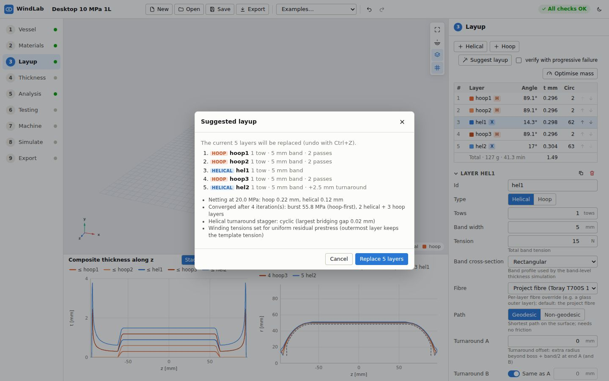

*The Suggested layup dialog lists the proposed layers and the sizing notes.*

*Suggest layup* sizes the layup from a netting estimate and refines it until the burst, failure-mode and
stress-ratio checks (and the FE, liner and rupture checks) pass. It takes the tows, band width and tension of
your **first helical and first hoop layer** as templates, staggers the helical turnarounds to limit fibre
bridging, and applies the tension schedule. The dialog lists the proposed layers and the notes (netting
thickness, iterations, burst and failure mode; checks it cannot fix by adding layers). **Replace N layers**
applies it (Ctrl+Z undoes); **Cancel** discards it.

#### Optimise mass

Opens a dialog with a **Time budget** (5 – 600 s, 60 s default). **Start** runs the backend optimiser, which
removes and resizes layers (tows, passes, turnaround offsets) to minimise mass while no check fails (tension
checks excepted). A progress bar shows the elapsed time; **Cancel** stops waiting. The result shows
**Mass before**, **Mass after**, **Evaluations** and a table of changed, new, removed and moved layers.
**Apply** replaces the layers (one undo step), **Discard** keeps the current layup. If the current layup
fails a check, the optimiser starts from the suggested layup.

#### Charts

- **Composite thickness along z**: *Stacked* (cumulative per layer), *Per layer* or *Total*.
- **Meridian profile**.

### 4.4 Thickness

A band-level simulation: every band of every circuit is laid with its real width and cross-section onto a
surface grid. It shows gaps, overlaps, crossover ridges and polar build-up peaks that the averaged model
cannot.

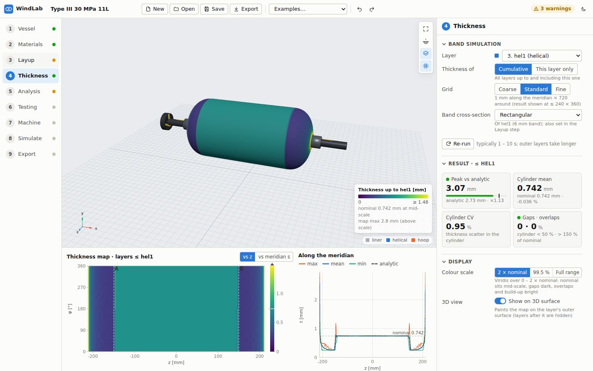

*Thickness map of layers 1 to hel1. The 3D view shows the map on the layer surface; below, the unrolled map
(z vs azimuth) and max / mean / min / analytic thickness along the meridian.*

**Band simulation**

- **Layer**: the layer to map (shared with the Layup selection).
- **Thickness of**: *Cumulative* (all layers up to and including this one) or *This layer only*.
- **Grid**: *Coarse* (2 mm × 360), *Standard* (1 mm × 720) or *Fine* (0.5 mm × 1440).
- **Band cross-section** of the selected layer (same field as on the Layup step).
- **Run / Re-run**: the map runs automatically when you change the layer, mode or grid (typically 1 – 10 s,
  longer for outer layers). A progress bar with **Cancel** shows while it runs. Project edits do not re-run
  it; the button then reads **Re-run (project changed)**.

**Result**

- **Peak vs analytic**: the largest local thickness vs the axisymmetric model (amber above 1.25×).
- **Cylinder mean**: mean thickness in the cylinder vs nominal.
- **Cylinder CV**: thickness scatter in the cylinder.
- **Gaps · overlaps**: share of the cylinder below 50 % (gaps, warning above 0.5 %) and above 150 % of
  nominal (overlaps, warning above 5 %).
- Warnings from the simulation.

**Display**

- **Colour scale**: *2 × nominal* (nominal in the middle; gaps dark, overlaps bright), *99.5 %* (robust
  maximum) or *Full range*.
- **3D view · Show on 3D surface**: paints the map on the layer's outer surface (layers after it are
  hidden).

**Charts**: the **thickness map** (x = z or meridian length s, y = azimuth φ; dashed lines A and B mark the
cylinder ends) and **Along the meridian** (max, mean, min and the analytic thickness; hovering over the map
moves a marker in this chart).

### 4.5 Analysis

All structural, reliability and cure results, and all checks.

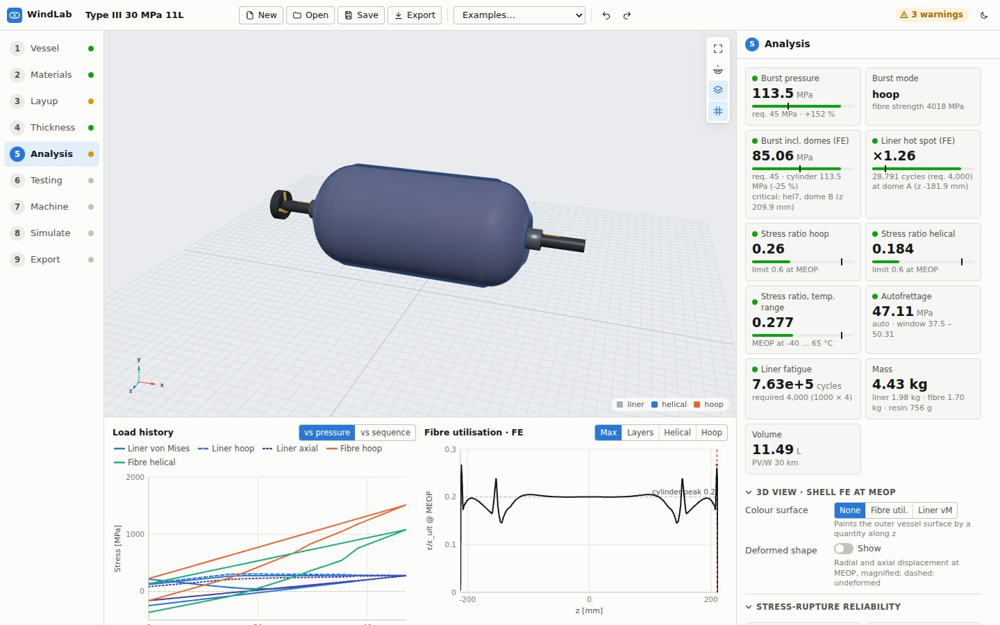

*Analysis step of the 30 MPa example: burst, FE burst including domes, liner hot spot, stress ratios,
autofrettage, fatigue, mass and volume. Below: load history and FE fibre utilisation.*

#### Key results (tiles)

| Tile | Meaning |
|---|---|
| **Burst pressure** | Cylinder burst vs required; the bar shows the margin |
| **Burst mode** | *hoop* or *helical* fibres fail first; plus the delivered fibre strength |
| **Burst incl. domes (FE)** | Cylinder burst scaled by the shell-FE fibre strain distribution over the whole vessel; names the critical layer and zone |
| **Liner hot spot (FE)** | Peak liner stress range / cylinder value (bending at dome and boss transitions) and the fatigue life there (Type III) |
| **Stress ratio hoop / helical** | Fibre stress at MEOP / strength vs the limit |
| **Stress ratio, temp. range** | Worst stress ratio at MEOP over the operating temperature range (thermal stresses included) |
| **Autofrettage** | Pressure and window (Type III) or *None* (Type IV) |
| **Liner fatigue** | Cycles vs required (Type III) |
| **Mass** and **Volume** | Liner, fibre and resin mass; water capacity and PV/W |

#### 3D view · shell FE at MEOP

- **Colour surface**: *None*, *Fibre util.* (largest fibre strain / allowable at each z) or *Liner vM* (liner
  von Mises). A colour legend appears in the 3D view.
- **Deformed shape · Show** with a **Scale factor** slider (1 – 500×; set automatically when switched on).

#### Stress-rupture reliability

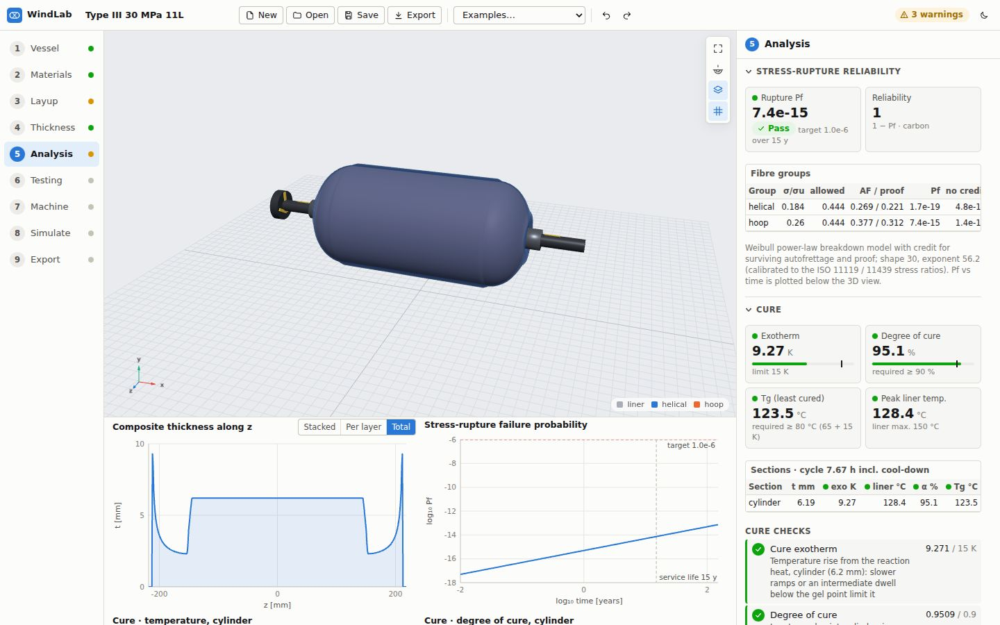

*Stress-rupture reliability and cure results. Below: the total thickness and the stress-rupture failure
probability vs time (log-log) with the target and service life.*

- **Rupture Pf** (Pass/Fail against the target over the service life) and **Reliability** (1 − Pf, with the
  fibre family).
- **Fibre groups** table: stress ratio at MEOP (σ/σu), the highest **allowed** MEOP ratio, the ratios at
  autofrettage / proof, **Pf** with credit for surviving the proof test, **no credit**, and **life y** to the
  target.
- The chart **Stress-rupture failure probability** plots log₁₀ Pf against log₁₀ time.

#### Cure

Shown when the cure simulation ran: tiles **Exotherm** (vs limit), **Degree of cure** (lowest, vs
required), **Tg (least cured)** (vs max. service temperature + margin) and **Peak liner temp.** (vs the liner
maximum); a **Sections** table (cylinder and the thickest dome section) and the **Cure checks**. The charts
**Cure · temperature** (oven, liner, laminate inner / mid / outer) and **Cure · degree of cure** have buttons
to switch the section. The cycle itself is edited on the Materials step.

#### Stress state table

Pressure, liner von Mises, liner hoop, hoop fibre and helical fibre stress at: **After cure**, **Residual
(0)** (after autofrettage, or after proof for Type IV), **MEOP cold**, **MEOP**, **MEOP hot** and **Proof**.
Hover over a row for its definition.

#### Pressure test targets · water jacket

The expected total and permanent **volumetric expansion** at autofrettage (Type III) and proof, at the
ambient test temperature. Compare them with your water-jacket readings: a much larger permanent expansion at
proof points to a liner or bond problem. The same card appears on the Testing and Export steps.

#### Burst scatter

**Compute burst scatter** (5 – 15 s) perturbs fibre strength, modulus and tex, Vf, translation efficiency,
liner yield and wall thickness and the stress-free temperature by one standard deviation each. Results:
**Burst 90 % lower bound** (amber if below the required burst), **Burst scatter** (standard deviation and
CoV), **P(burst < required)**, and a table of each input's **Δ burst** and **share** of the variance. Tighten
the input with the largest share first.

#### Progressive failure

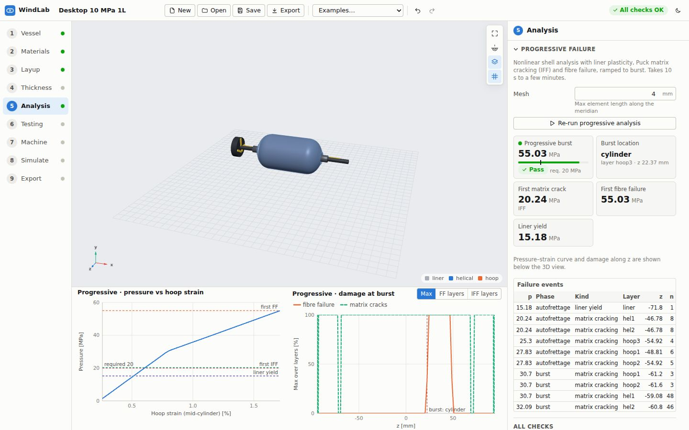

*Progressive failure of the desktop example (about 20 s): burst 55 MPa in the cylinder, first matrix crack,
first fibre failure and liner yield, the failure events, and the pressure–strain and damage charts.*

A nonlinear shell analysis with liner plasticity, Puck matrix cracking (inter-fibre failure, IFF) and fibre
failure. It applies the full load history (cure, autofrettage, proof, MEOP) and then ramps the pressure to
burst.

- **Mesh**: maximum element length along the meridian (1 – 20 mm, 4 mm default). Larger is faster.
- **Run progressive analysis** (10 s to a few minutes; **Cancel** while running). The result survives step
  changes, is marked stale after edits, and is cleared when you load or create a project.
- Tiles: **Progressive burst** (Pass/Fail vs required), **Burst location** (zone, layer, z), **First matrix
  crack**, **First fibre failure**, **Liner yield**.
- **Failure events** table: pressure, phase, kind (matrix cracking, fibre failure, liner yield, liner
  rupture, burst), layer, z and count; notes.
- Charts (at the end of the chart area): **Progressive · pressure vs hoop strain** (with required burst,
  first IFF, first FF and liner yield lines), **Progressive · damage at burst** (*Max*, *FF layers*, *IFF
  layers*) and **Progressive · liner plastic strain at burst**.

#### All checks

The complete list of checks, worst first. See [section 6](#6-understanding-the-checks).

#### Charts

Load history (*vs pressure* or *vs sequence*, with the phases shaded), Fibre utilisation · FE (*Max*,
*Layers*, *Helical*, *Hoop*; the boss clamp zone is shaded and excluded), Liner von Mises · FE, Fibre stress
at MEOP along z, Composite thickness along z, the stress-rupture and cure charts, and the progressive charts
once run.

### 4.6 Testing

Enter test results and correlate the model with them.

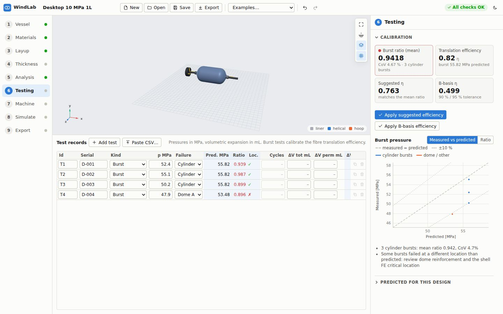

*Four burst tests pasted from CSV. The calibration shows a mean measured/predicted ratio of 0.94 and
suggests a translation efficiency of 0.763; the dome burst (T4) is plotted separately.*

#### Test records (below the 3D view)

- **Add test** adds a record (a cylinder burst at the predicted burst pressure, dated today).
- **Paste CSV…** imports rows copied from a spreadsheet (tab separated) or CSV (comma or semicolon). A header
  row maps columns by name: `serial, kind, pressure, failure_location, cycles, volumetric_expansion_total,
  volumetric_expansion_permanent, date, notes`. Short forms such as `location`, `expansion_total` or `sn`
  work, and a `pressure [bar]` column is converted to MPa. Without a header the order is: serial, kind,
  pressure [MPa], location, ΔV total, ΔV permanent, date, notes. Choose **Append** or **Replace all**; lines
  that cannot be read are listed.
- Columns: **Id**, **Serial**, **Kind** (*Burst*, *Proof*, *Autofrettage*, *Cycle*), **p MPa**, **Failure**
  (*Cylinder*, *Dome A*, *Dome B*, *Boss*, *Leak*, *None*), and computed **Pred. MPa**, **Ratio**
  (measured / predicted, red below 1), **Loc.** (✓ failed where predicted, ✗ elsewhere); then **Cycles**,
  **ΔV tot mL**, **ΔV perm mL**, computed **ΔV ratio**, **Date**, **Notes**, and **Duplicate** / **Delete**.

Example CSV:

```
serial,kind,pressure,location,expansion_total,expansion_permanent,date
D-001,burst,52.4,cylinder,,,2026-09-01
D-002,burst,55.1,cylinder,,,2026-09-02
```

#### Calibration (panel)

Recomputed automatically a moment after each change while the Testing step is open.

- **Burst ratio (mean)**: measured / predicted, mean over **cylinder** bursts, with the CoV (green within
  ±5 %, red below, amber above).
- **Translation efficiency**: the current value and predicted burst.
- **Suggested η**: the efficiency that makes the mean predicted cylinder burst match the tests.
- **B-basis η**: mean − k·sd of the ratio (one-sided tolerance, 90 % content / 95 % confidence) times η;
  needs at least 2 cylinder bursts.
- **Apply suggested efficiency** / **Apply B-basis efficiency** set the translation efficiency (one undo
  step). They are disabled if the value is not above 0.3 and at most 1 (a warning explains why).
- Chart **Burst pressure**: *Measured vs predicted* (with the 1:1 and ±10 % lines; cylinder bursts and
  dome/other bursts in different colours) or *Ratio* bars per test.
- Notes, for example when bursts failed away from the predicted location.
- **Predicted for this design** (collapsed): the water-jacket targets.

### 4.7 Machine

The winding machine, its axes, the kinematics settings, the G-code output options and continuous winding.

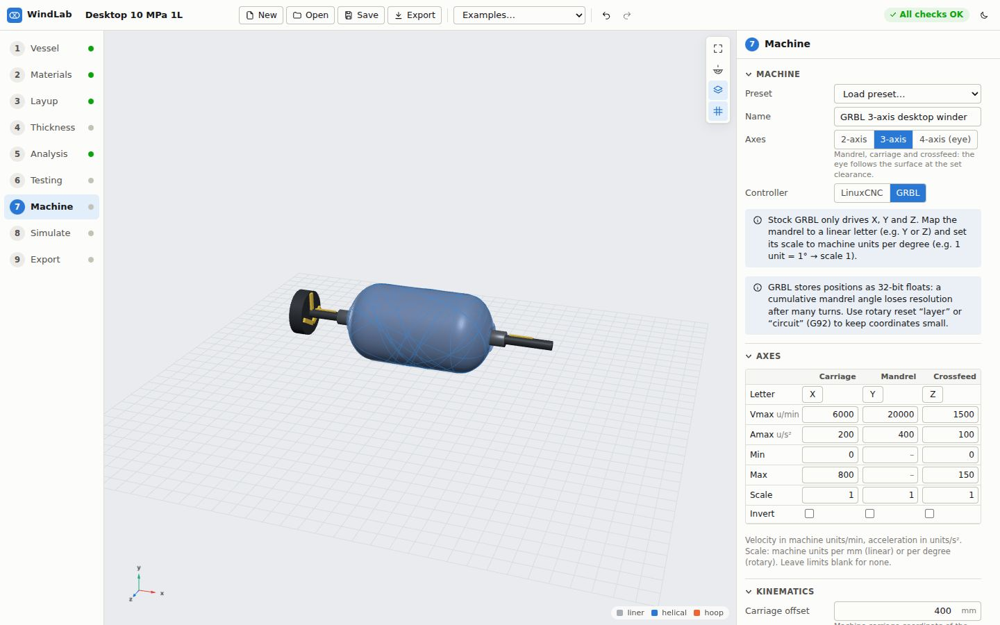

*Machine step of the GRBL desktop example: the GRBL hints and the axes table (letter, velocity,
acceleration, soft limits, scale and direction per axis).*

#### Machine

- **Preset**: load a machine: *LinuxCNC 4-axis (X carriage, Y crossfeed, A mandrel, B eye)*, *LinuxCNC
  3-axis*, *GRBL 3-axis (X carriage, Y mandrel in deg, Z crossfeed)*, *GRBL 2-axis (eye at fixed radius)*,
  *grblHAL 4-axis*. A preset replaces all machine settings (undoable).
- **Name**.
- **Axes**: *2-axis* (mandrel + carriage; the eye stays at one fixed radius clear of the whole part),
  *3-axis* (adds crossfeed: the eye follows the surface at the set clearance), *4-axis (eye)* (adds
  payout-eye rotation so the band stays flat on the domes).
- **Controller**: *LinuxCNC* or *GRBL*. With GRBL, info and warning banners explain its limits (see
  [5.3](#53-set-up-a-machine-and-generate-g-code-linuxcnc-and-grbl)).

#### Axes table

One column per axis (**Carriage**, **Mandrel**, **Crossfeed**, **Eye**, as the axis count requires):

| Row | Meaning |
|---|---|
| **Letter** | G-code axis letter |
| **Vmax** | Maximum velocity [machine units/min] |
| **Amax** | Maximum acceleration [machine units/s²] |
| **Min / Max** | Soft limits in machine units (blank = none) |
| **Scale** | Machine units per mm (linear axes) or per degree (rotary axes) |
| **Invert** | Reverse the axis direction |

#### Kinematics

| Field | Meaning | Typical |
|---|---|---|
| **Carriage offset** | Machine carriage coordinate of the vessel mid-plane (z = 0) | Half the carriage travel |
| **Crossfeed zero radius** (3/4-axis) | Eye distance from the mandrel axis when the crossfeed reads 0 | Measure on the machine |
| **Eye clearance** | Clearance of the eye from the wound surface (2-axis: from the largest wound radius) | 10 – 20 mm (15 default) |
| **Fibre speed** | Target fibre delivery speed (hint in m/min) | 100 mm/s |
| **Samples per pass** | Path resolution per traverse (20 – 2000) | 160 |

#### Output

- **Tension output**: *None*, *M67 analog out (LinuxCNC)* or *Spindle S word / PWM*, with **Tension scale**
  (output units per newton).
- **Rotary reset**: *None (cumulative angle)*, *Every layer* or *Every circuit*: re-zeroes the mandrel
  coordinate with G92 to keep numbers small.
- **Pause between layers**: *M0 pause* or *No pause* (skipped when continuous winding is on).

#### Continuous winding

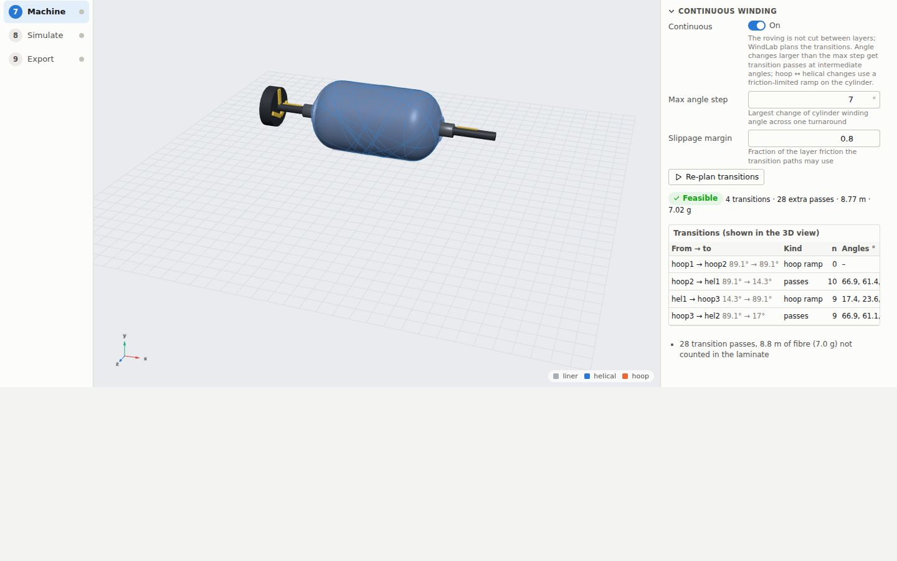

*Continuous winding on the desktop example: 4 transitions, 28 extra passes, 8.8 m (7.0 g) of fibre. The
transition paths are drawn in the 3D view.*

- **Continuous** On/Off: wind all layers without cutting the roving.
- **Max angle step**: largest change of the cylinder winding angle across one turnaround (7° default,
  0.5 – 45°). Larger changes get transition passes at intermediate angles.
- **Slippage margin**: fraction of the layer friction the transition paths may use (0.8 default).
- **Plan transitions** / **Re-plan transitions**: computes the plan. The summary shows *Feasible* or *Not
  feasible*, the number of transitions, extra passes, fibre length and mass. The **Transitions** table lists,
  per pair of layers: from → to (with angles), kind (*direct*, *passes*, *hoop ramp*), number of passes, their
  angles, max slippage / friction limit, fibre length, mass, phase-matching dwell and OK. Notes per
  transition follow. The paths are drawn in the 3D view (while on the Machine step).

Planning works whether or not *Continuous* is on; the G-code only includes the transitions when it is on.

### 4.8 Simulate

Plays back the machine motion for one layer.

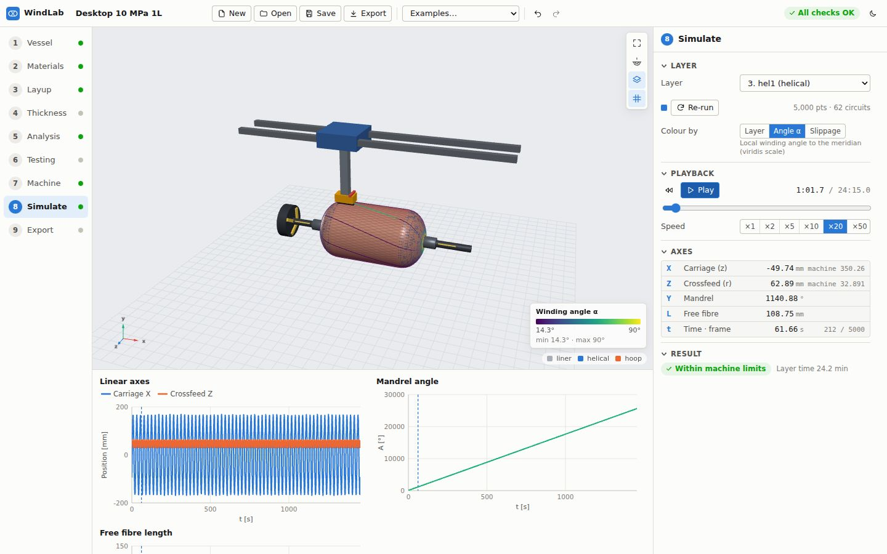

*Simulating layer hel1 of the desktop example on the GRBL 3-axis machine, coloured by winding angle. The
charts show the axis positions over time with the current time marked.*

#### Layer

- **Layer**: the layer to simulate. Changing it runs the simulation; **Re-run** repeats it (*Re-run
  (project changed)* after edits). The point and circuit counts are shown.
- **Colour by**: *Layer* (the layer colour), *Angle α* (local winding angle) or *Slippage* (slippage
  utilisation |kg/kn| / μ; at or above 1 the fibre slides; geodesic paths need none). A colour scale appears
  in the 3D view.

While simulating, the 3D view shows the vessel as it is before that layer, the machine (carriage, crossfeed,
eye), the fibre path and the free fibre from the eye to the contact point.

#### Playback

**Rewind**, **Play/Pause**, the current and total time, a time slider, and **Speed** ×1, ×2, ×5, ×10, ×20,
×50.

#### Axes

A live readout of each axis at the current time: carriage (z, and the machine coordinate including the
carriage offset), crossfeed (r, and the machine coordinate) or the fixed eye radius on a 2-axis machine,
mandrel angle, eye angle (4-axis), free fibre length, time and frame.

#### Result

*Within machine limits* or *Machine limits exceeded*, the layer time, and the warnings (eye jumps, free fibre
cutting into the build-up, long free fibre, clipped eye positions, limit violations).

#### Charts

**Linear axes** (carriage and crossfeed), **Mandrel angle**, **Eye angle** (4-axis) and **Free fibre
length** against time, with the playback time marked.

### 4.9 Export

G-code, the traveller, the design report and the FE exports.

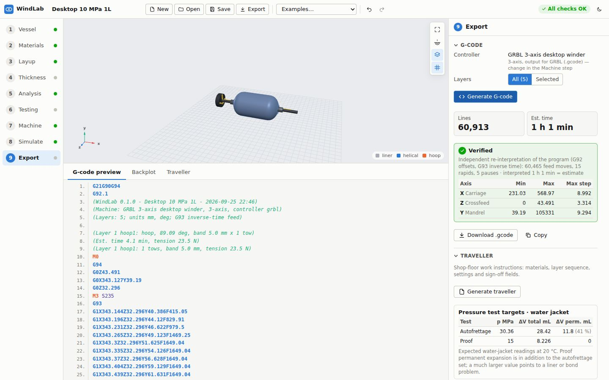

*G-code for the GRBL desktop winder: 60 913 lines, 1 h 1 min. The verification re-interprets the program and
reports the axis ranges and largest steps.*

#### G-code

- **Controller**: the machine name, axis count and output format (*LinuxCNC (.ngc)* or *GRBL (.gcode)*);
  change it on the Machine step.
- **Layers**: *All* or *Selected* (then tick the layers). With continuous winding on, a banner reminds you
  that transitions are included and pauses skipped.
- **Generate G-code**. Results: **Lines**, **Est. time**, warnings, and a **verification** card: an
  independent re-interpretation of the program (G92 offsets, G93 inverse time) with the number of feed
  moves, rapids and pauses, the interpreted time (= estimate or ≠), and a table of each axis's physical
  **Min**, **Max** and **Max step** per move. Values outside the soft limits are shown in red with a note;
  errors are listed. The card title reads *Verified*, *Verified with a time mismatch* or *Verification found
  problems*.
- **Download .ngc / .gcode** and **Copy** (to the clipboard).
- A banner says when the project has changed since generation: regenerate before running.

Below the 3D view:

- **G-code preview**: the first 300 lines with syntax colouring.
- **Backplot**: **Plot the program** parses the whole file in the browser and plots each axis's physical
  position (programmed + G92 offsets) *vs line* or *vs time*, with the layer starts marked. The header gives
  the feed moves, layers, G92 resets, estimated time and parse time.

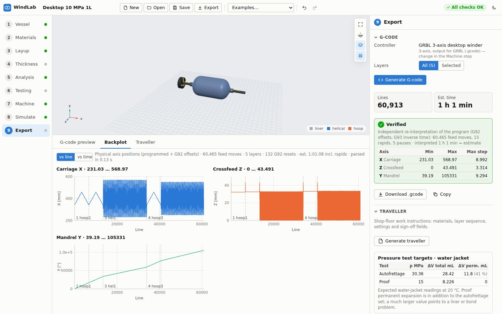

*Backplot of the whole program: carriage, crossfeed and mandrel positions against the line number, with the
layer starts marked.*

#### Traveller

**Generate traveller** creates shop-floor work instructions: design summary, bill of materials, preparation,
winding sequence (per-layer settings and sign-off), cure, autofrettage and proof (with the expansion
targets) and release. The **Traveller** tab below the 3D view previews it with **Print**, **HTML** and
**Markdown** (download) buttons. The water-jacket targets card is repeated in this section.

#### Report

**Design report** opens a self-contained, printable HTML report in a new tab: design checks, requirements,
liner and materials, layup, structural analysis, manufacturing (with the transitions when continuous winding
is on) and assumptions and limitations. Tick **include progressive failure** to add the progressive failure
analysis (a few minutes). Afterwards **Open** re-opens it and **.html** downloads it. If the browser blocks
the new tab, a link is shown instead.

#### FEA export

- **Abaqus export**: an axisymmetric shell (SAX1) input deck of liner and layup plus the layup table as CSV;
  both files download. The tiles show the elements and material / section definitions. The deck has not
  been validated in Abaqus by the WindLab authors (a banner says so): check units (mm, MPa, N), section
  orientations, boundary conditions and loads before use.
- **CalculiX export**: an axisymmetric solid deck (CAX8/CAX6, one element row per layer, liner plasticity)
  with cure cool-down, autofrettage (Type III), proof and MEOP steps; the `.inp` downloads. Tiles show
  elements, nodes and materials and the list of steps. See [5.7](#57-exporting-to-calculix-and-comparing).

---

## 5. Workflows

### 5.1 Design a Type III vessel from scratch

1. **New** in the top bar, confirm, and type a project name.
2. **Vessel step.**
   1. Choose the liner **Material** (e.g. Aluminium 6061-T6). Check that the badge says *Type III*.
   2. Enter the **Outer radius**, **Cylinder length** and **Wall thickness**, choose the **Dome type** and
      the **Boss radius A / B**, **Boss length** and **Shaft radius**. Leave neck thickness and blend radius
      on *Auto* unless you have a drawing.
   3. Enter **MEOP**, **Burst factor**, **Proof factor** and **Design cycles** from your standard. Leave
      **Autofrettage** on *Auto*.
   4. Set the **Operating temp.** range and **Ambient (test)**.
   5. Open **Stress rupture** and set the service life and target Pf if they differ from 15 years / 1e-6.
3. **Materials step.** Choose the **Fibre** and **Resin**; set the **Fibre volume fraction** and
   **Translation efficiency** you expect from your process (0.82 if unknown; calibrate later). Set the **Cure
   temperature** to the final cure hold (click **use … °C** to take the resin's value). If you have qualified
   material data, duplicate the built-in record as custom and enter it.
4. **Layup step.**
   1. Edit the existing helical and hoop layers to your **Tows**, **Band width** and **Tension** (these are
      the templates for *Suggest layup*).
   2. Click **Suggest layup**, review the layers and notes, and click **Replace N layers**.
   3. Look at the **Layup checks** and the warning marks in the layer table. Fix bridging or slippage
      warnings with turnaround offsets, end offsets or friction (see [section 8](#8-troubleshooting-and-faq)).
   4. Optionally choose a **Pattern style** for each helical layer.
   5. In **Winding tension**, click **Apply recommended tensions** if the residual spread is large.
   6. Optionally run **Optimise mass** and apply the result.
5. **Thickness step.** Run the band simulation for the outermost layer (*Cumulative*). Check gaps, overlaps
   and the peak vs analytic ratio.
6. **Analysis step.** Confirm that all checks pass: burst and burst including domes, hoop-first failure,
   stress ratios, autofrettage window, reverse yield, liner fatigue and FE hot spot, leak-before-burst,
   stress-rupture Pf and the cure checks. Then:
   1. **Compute burst scatter** and check that the 90 % lower bound is above the required burst.
   2. **Run progressive analysis** and check that the progressive burst meets the requirement and the burst
      location is the cylinder.
7. **Save** the project, then continue with [5.3](#53-set-up-a-machine-and-generate-g-code-linuxcnc-and-grbl).
8. Before building hardware, validate the domes with FEA ([5.7](#57-exporting-to-calculix-and-comparing)) and
   plan burst tests to calibrate the model ([5.6](#56-correlating-burst-tests-calibration)).

### 5.2 Design a Type IV hydrogen vessel

The *Type IV hydrogen, 35 MPa NWP* example is a complete reference.

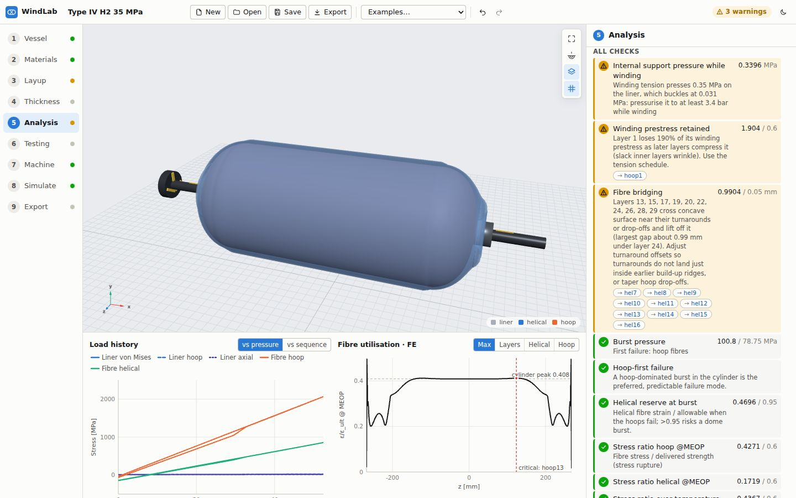

*The checks of the Type IV example. The warnings say the liner needs about 3.4 bar internal pressure while
winding, the first hoop layer loses its prestress, and some helical layers bridge concave surface.*

1. **Vessel step.**
   1. Choose a polymer liner (**HDPE** or **PA6**). The badge changes to *Type IV (polymer liner)*,
      autofrettage shows *None*, and the **Permeation (Type IV)** section opens.
   2. Enter the geometry. Polymer liners are thicker than metal ones (the example uses 5 mm HDPE).
   3. Set **MEOP** from the nominal working pressure (NWP): for hydrogen typically MEOP = 1.25 × NWP. Set the
      burst and proof factors so that burst and proof relate to NWP as your standard requires (the example
      uses MEOP 43.75 MPa, burst factor 1.8 and proof factor 1.2, that is 2.25 × and 1.5 × NWP).
   4. Set the **Operating temp.** range; hydrogen tanks often need up to 85 °C.
   5. In **Permeation**, set the **Permeation limit** (e.g. 46 NmL/h/L) and the **Permeation temp.** (e.g.
      55 °C).
2. **Materials step: cure temperature limits.** The polymer liner limits the cure temperature (HDPE 85 °C,
   PA6 120 °C maximum in the built-in data).
   1. Choose a resin that cures below that limit, such as *Low-temperature epoxy / amine (Type IV liners)*.
   2. Set the **Cure temperature** below the liner maximum (the example uses 80 °C).
   3. Build a cure cycle that stays below the limit including the exotherm, or use **Suggest cycle** (see
      [5.5](#55-choosing-a-cure-cycle)). The *Liner temperature during cure* check compares the peak liner
      temperature (including exotherm) with the liner maximum.
   4. Check that the Tg reaches the maximum service temperature + **Tg margin**; the example lowers the margin
      to 10 K because a low-temperature cure limits the Tg.
3. **Layup step.** Suggest the layup as for Type III. Then:
   - **Support pressure**: the *Internal support pressure while winding* check compares the pressure that the
     winding tension puts on the liner with half the liner's buckling pressure. When it warns, its detail
     gives the internal pressure needed (in bar) while winding. Pressurise the liner to at least that value
     during winding, or reduce the tension.
   - Watch the *Winding prestress retained* and *Fibre bridging* checks (see [section 6](#6-understanding-the-checks)).
4. **Analysis step.** Check *Liner strain at proof*, *Liner temperature during cure within limit*, *Service
   temperature within liner limit* and *H2 permeation*, as well as burst, stress ratio and stress rupture.
   If permeation fails, use a thicker liner or PA6. If liner strain fails, stiffen the overwrap in the
   direction that strains most (Suggest layup does this automatically).
5. Run the **progressive failure** analysis; the burst must reach the required value.
6. Continue with the machine set-up. Remember the support pressure in the traveller notes of your process.

### 5.3 Set up a machine and generate G-code (LinuxCNC and GRBL)

**Set up the machine**

1. Go to the **Machine** step and load the closest **Preset**.
2. Check **Axes** (2, 3 or 4) and **Controller**.
3. In the **Axes** table, enter your axis **letters**, **Vmax**, **Amax**, **soft limits**, **Scale** and
   **Invert** as configured in the controller. Rotary axes are in degrees × scale; linear axes in mm × scale.
4. Enter the **Carriage offset** (machine carriage coordinate of the vessel mid-plane) and, on 3/4-axis
   machines, the **Crossfeed zero radius** (eye distance from the mandrel axis at crossfeed 0). Measure both
   on the machine.
5. Set the **Eye clearance**, **Fibre speed** and **Samples per pass**.
6. Choose the **Tension output**, **Rotary reset** and **Pause between layers**.

**LinuxCNC specifics**

- Output `.ngc`, with feed in inverse time (G93), `M68 E0 Q…` for tension when *M67 analog out* is chosen,
  and `(MSG, …)` + `M0` pauses between layers.
- A, B and C letters are fine for rotary axes.

**GRBL specifics**

- Stock GRBL only drives **X, Y and Z**. Map the mandrel to a linear letter (e.g. Y) and set its scale to
  machine units per degree (1 unit = 1° → scale 1), as the *GRBL 3-axis* preset does. A, B or C letters need
  grblHAL or a multi-axis fork; the UI and G-code warnings say so.
- GRBL has no M67 analog output: use **Spindle S word / PWM** for tension (M3 S…).
- GRBL stores positions as 32-bit floats. Use **Rotary reset** *Every layer* or *Every circuit* so the mandrel
  coordinate is re-zeroed with G92.
- The output is compact (no spaces) and lines are kept short for the GRBL line buffer.

**Simulate and verify**

1. Go to **Simulate**, pick each layer in turn, and check *Within machine limits* and the warnings. Play
   through the turnarounds and look at the eye and free fibre.
2. Go to **Export**, choose **All** layers (or **Selected**), and click **Generate G-code**.
3. Read the warnings. Check that the verification card says **Verified**, that the interpreted time equals
   the estimate, and that no axis range is red (outside the soft limits).
4. Open **Backplot** and check the axis motion over the program.
5. **Download** the file.
6. **Dry-run** it on the machine without fibre and without the mandrel, with a low feed override. Check the
   axis directions, the carriage offset and the crossfeed zero before the first real wind.

### 5.4 Continuous winding

1. Finish the layup (continuous winding joins the layers in their order).
2. On the **Machine** step, open **Continuous winding** and switch **Continuous** on.
3. Keep **Max angle step** at 7° and **Slippage margin** at 0.8 to start with.
4. Click **Plan transitions**. Look at the summary (*Feasible*), the transitions table and the paths in the
   3D view.
   - *direct*: consecutive helical layers whose angle differs by up to the max step join directly.
   - *passes*: larger angle changes get transition passes at intermediate angles and turnaround radii,
     each dome leg checked against friction.
   - *hoop ramp*: hoop ↔ helical changes use a friction-limited angle ramp on the cylinder.
   - The dwell column is the phase-matching dwell that keeps the next layer's planned pattern.
5. If a transition is *No* (not feasible), read its notes: raise the friction or the slippage margin, reduce
   the max angle step, reorder layers, or wind those layers separately (switch continuous off).
6. On **Export**, **Generate G-code**: the program now winds the whole vessel in one go with no pauses
   between layers. Transition notes also appear as G-code warnings. Exporting a subset of layers joins the
   selected layers with transitions (with a warning if they are not adjacent).
7. Report the extra fibre (length and mass) in your material planning; it is not part of the laminate.

### 5.5 Choosing a cure cycle

1. On the **Materials** step, choose the **Resin**. Its recommended cycle is used while **Use resin
   recommended cycle** is on.
2. Set the limits: **Max. exotherm**, **Min. degree of cure**, **Tg margin** and the **Oven heat transfer** of
   your oven (still air 10 – 20, forced convection 25 – 50 W/m²K).
3. Click **Suggest cycle**. WindLab searches for the shortest cycle that keeps the exotherm, degree of cure,
   Tg and liner temperature within their limits, writes it into the project (turning the resin cycle off) and
   sets the cure (stress-free) temperature to its final hold. Read the notes.
4. Or edit the steps by hand: switch the resin cycle off and enter ramps, set points and holds. For thick
   laminates, slow ramps and a low first dwell limit the exotherm (the 70 MPa example uses 0.5 K/min to 80 °C,
   then 100 °C and 130 °C).
5. On the **Analysis** step, check the **Cure** section: exotherm, degree of cure, Tg and peak liner
   temperature per section, and the temperature and degree-of-cure charts.
6. Make sure the **Cure temperature** matches the highest set point; the Materials panel warns when it does
   not.

The kinetics are generic per resin family. For a real resin, fit A₁, E₁, A₂, E₂, m, n and the heat of
reaction to DSC data and enter them in a custom resin (**Cure kinetics (DSC)** in the editor).

### 5.6 Correlating burst tests (calibration)

1. Burst-test vessels built to the design (at least two cylinder bursts for a B-basis value).
2. On the **Testing** step, enter the results with **Add test** or **Paste CSV…**. For each test give the
   kind, pressure, failure location and, if measured, the volumetric expansion.
3. Read the calibration:
   - **Burst ratio (mean)** close to 1 means the model predicts the cylinder burst well.
   - **Loc.** ✗ marks tests that failed away from the predicted location. Bursts in the domes or at the boss
     are not used for the mean; review the dome reinforcement and the FE critical location.
   - **ΔV ratio** compares measured and predicted expansion.
4. Click **Apply suggested efficiency** to match the mean, or **Apply B-basis efficiency** for a design
   allowable. This sets the translation efficiency on the Materials step.
5. Re-check the design on the **Analysis** step with the calibrated efficiency; re-size the layup if needed.
6. Save the project: the test records are part of it.

### 5.7 Exporting to CalculiX and comparing

The CalculiX deck is an independent axisymmetric solid model with liner plasticity. Use it when the liner's
plastic strain at autofrettage matters or to check the domes.

1. On **Export**, click **CalculiX export** and save the `.inp`. The panel lists the steps (cure cool-down,
   autofrettage, proof, MEOP).
2. Run it yourself: `ccx -i <deck name without .inp>`.
3. Or let WindLab run and compare it: **Export** the project JSON from the top bar, then

   ```bash
   windlab ccx my_tank.json --run ccx_run          # needs ccx on the PATH
   windlab ccx my_tank.json --run ccx_run --mesh 2 # finer mesh (max element length, mm; default 4)
   ```

   It prints the hoop strain at the cylinder mid-plane per step: CalculiX at the liner inner surface and
   composite outer surface, and WindLab's cylinder model. The composite should agree within a few percent
   (see [VALIDATION.md](VALIDATION.md)); the liner inner surface strains more than the thin-wall model
   predicts.
4. To only write the deck: `windlab ccx my_tank.json -o tank.inp`.

For Abaqus, use **Abaqus export** (SAX1 shell deck + layup CSV) and check normals, ply order and loads on
first use.

---

## 6. Understanding the checks

Every analysis produces a list of checks with a status: **ok**, **warn**, **fail** or **info**. The table
lists every check. *Step* is where the check's status dot appears and where you usually fix it.

| Check id | Label | Step | Meaning | When it fails or warns |
|---|---|---|---|---|
| `geo.boss` | Unequal polar openings | Vessel | Info: geodesic paths use one turnaround radius, set by the larger boss | Use non-geodesic helicals to turn close to each boss |
| `layer.<id>` | Layer n | Layup | Warning raised while building the layer (pattern number not reachable, pattern gaps, dwell above the limit, no pattern within the dwell limit, geodesic path at the larger radius) | Read the detail; adjust pattern style, max dwell, band width or path type |
| `layer.<id>.path` | Layer n path | Layup | **Fail**: the non-geodesic path is not feasible; the layer falls back to a geodesic path | Change the cylinder angle (or Auto), friction or turnaround offsets |
| `layer.<id>.slip` | Layer n slippage | Layup | Required slippage on the domes vs available friction μ. Warns up to 1.25 μ, fails above | Raise friction only if measured; change the angle (Auto balances both domes) or turnaround offsets |
| `layup.empty` | Layup | Layup | **Fail**: no structural result (no layers) | Add layers or use Suggest layup |
| `burst` | Burst pressure | Analysis | Cylinder burst ≥ required burst | Add hoop or helical layers (Suggest layup), raise efficiency only from tests |
| `burst.mode` | Hoop-first failure | Analysis | Warns when helicals fail first; a hoop-first burst in the cylinder is the preferred failure mode | Add helical layers or reduce hoops |
| `burst.balance` | Helical reserve at burst | Analysis | Helical fibre strain / allowable when the hoops fail; warns above 0.95 (dome burst risk) | Add helical layers |
| `sr.hoop` | Stress ratio hoop @MEOP | Analysis | Hoop fibre stress / delivered strength at MEOP ≤ limit | Add hoop layers |
| `sr.helical` | Stress ratio helical @MEOP | Analysis | Same for helical fibres | Add helical layers |
| `sr.temp` | Stress ratio over temperature range | Analysis | Worst stress ratio at MEOP over the operating temperature range, including cure residual stresses | Add hoops; check the cure temperature and temperature range |
| `sr.reliability` | Stress-rupture probability over N years | Analysis | Weibull power-law Pf over the service life (with proof-test credit) ≤ target | Lower the fibre stress (more fibre), shorten time at MEOP only if justified |
| `cure.exotherm` | Cure exotherm | Materials | Laminate temperature rise from the reaction heat ≤ max. exotherm | Slower ramps or an intermediate dwell below the gel point; Suggest cycle |
| `cure.degree` | Degree of cure | Materials | Lowest final degree of cure ≥ minimum | Longer or hotter final hold |
| `cure.tg` | Glass transition vs service temperature | Materials | Tg of the least-cured laminate ≥ max. service temperature + Tg margin | Hotter or longer cure, higher-Tg resin |
| `liner.cure_temp` | Liner temperature during cure | Vessel | Type III: peak liner temperature (with exotherm) ≤ liner maximum (ageing / temper) | Lower the cure temperature or exotherm |
| `liner.temp` | Liner elastic over temperature range | Vessel | Type III: liner von Mises / yield at 0 and MEOP at min. and max. temperature ≤ 1 | Thicker overwrap, adjust autofrettage, check the temperature range |
| `liner.lbb` | Leak-before-burst (liner) | Vessel | Type III: a through-wall crack of length 2t is stable at MEOP (K ≤ K_IC) | Lower the liner hoop stress (more hoops) or use a tougher liner |
| `af.window` | Autofrettage window | Vessel | Type III: a feasible autofrettage range exists | Stiffen the overwrap or change the liner wall |
| `af.reverse` | No reverse yield after autofrettage | Vessel | Residual liner von Mises / yield ≤ 0.9 (Bauschinger allowance) | Lower the autofrettage pressure or stiffen the overwrap |
| `af.fiber` | Fibre strain during autofrettage | Vessel | Fibre strain ratio during autofrettage ≤ 0.75; warns below 1, fails at 1 or more (fibres would fail) | Lower the autofrettage pressure, add fibre |
| `liner.meop` | Liner elastic at MEOP | Vessel | Liner von Mises / yield at MEOP ≤ 1 | More overwrap, autofrettage |
| `liner.proof` | Liner elastic at proof | Vessel | Warns if the liner yields at proof; proof below the autofrettage pressure keeps it elastic | Raise the autofrettage pressure above proof |
| `fatigue` | Liner fatigue life | Vessel | Liner cycles (SWT, indicative S-N data) ≥ design cycles × scatter factor | Lower the liner stress range (more overwrap, autofrettage); confirm by test |
| `liner.strain` | Liner strain at proof | Vessel | Type IV: liner strain at proof ≤ the liner's strain limit | Stiffen the overwrap in the direction that strains most |
| `liner.cure` | Liner temperature during cure within limit | Vessel | Type IV: peak liner temperature during cure (with exotherm) ≤ liner maximum | Low-temperature resin and cycle |
| `liner.service_temp` | Service temperature within liner limit | Vessel | Type IV: max. operating temperature ≤ liner maximum | Different liner material or temperature range |
| `liner.permeation` | H2 permeation | Vessel | Type IV: steady-state H₂ permeation at MEOP and the test temperature ≤ limit | Thicker liner or PA6 |
| `liner.support` | Internal support pressure while winding | Layup | Type IV: warns when the winding tension presses on the liner more than half its buckling pressure; the detail gives the internal pressure (bar) needed while winding | Pressurise the liner while winding, or lower the tension |
| `tension.loss` | Winding prestress retained | Layup | Largest fraction of a layer's winding prestress relaxed by the layers on top ≤ 60 %. Warns (rather than fails) when the layer keeps some residual prestress, or for polymer liners | Use the tension schedule (Apply recommended tensions) |
| `layup.bridging` | Fibre bridging | Layup | Warns when helical layers cross concave surface near their turnarounds or drop-offs and lift off it by more than 0.05 mm | Change turnaround offsets so turnarounds do not land just inside earlier build-up ridges; taper hoop drop-offs |
| `fe.burst` | Burst incl. domes (FE) | Analysis | Cylinder burst scaled by the FE fibre strain distribution ≥ required | Reinforce the critical zone named in the detail (dome: helicals) |
| `fe.liner` | Liner fatigue hot spot (FE) | Analysis | Type III: liner fatigue at the FE hot spot (dome / boss bending) ≥ required cycles | Reinforce the domes (hot spot on a dome) or the cylinder |
| `dome.netting` | Dome / cylinder helical stress | Layup | Netting estimate; warns above 1.1 (the dome is the critical helical zone) | Add helical layers or change turnaround offsets |

**Blocking checks.** *Suggest layup* adds layers until the burst, failure mode, stress ratio, stress-rupture,
FE and liner checks pass; it reports the checks it cannot fix by adding layers (slippage, path). *Optimise
mass* accepts only layups without failures (tension checks excepted).

**Warnings from the simulation and G-code** are not checks but appear on the Simulate and Export steps:
eye jumps, free-fibre clearance, long free fibre, clipped eye positions, soft limits, GRBL letters and float
precision, and transition notes.

---

## 7. Command line and HTTP API

### 7.1 `windlab` command

| Command | What it does |
|---|---|
| `windlab serve [--host 127.0.0.1] [--port 8000]` | Run the web app and API |
| `windlab analyze PROJECT.json` | Analyse a project and print burst, autofrettage window, mass, volume, PV/W and every check with value and limit. **Exit code 1** if any check fails, 0 otherwise |
| `windlab gcode PROJECT.json [-o OUT] [--layers ID ...]` | Post-process to G-code for the project's machine and controller. Default file name from the project; `--layers` selects layer ids (default all). Warnings go to stderr; it prints the line count and estimated time |
| `windlab ccx PROJECT.json [-o OUT] [--mesh 4.0]` | Write a CalculiX axisymmetric solid deck; prints elements, nodes and materials |
| `windlab ccx PROJECT.json --run DIR [--mesh 4.0]` | Write the deck into DIR, run `ccx`, and print the hoop strain comparison per step |

`PROJECT.json` is the file the top bar's **Export** button downloads (or a server-saved project from
`WINDLAB_PROJECTS`). Examples:

```bash
windlab analyze my_tank.json && windlab gcode my_tank.json -o my_tank.ngc
windlab gcode my_tank.json --layers hoop1 hel1 -o first_two.ngc
```

The `analyze` exit code makes it easy to use in scripts or CI to guard a released design against changes.

### 7.2 HTTP API

The web UI uses a stateless JSON API under `/api`: every compute request carries the whole project. All
endpoints (analyze, suggest-layup, path, simulate, gcode, thickness-map, tension-schedule, optimise,
calibrate, sensitivity, suggest-cure, continuous, progressive, report, ccx-export, fea-export, traveller and
project storage) are documented in [API.md](API.md). Invalid or infeasible designs return HTTP 422 with a
`detail` message, the same text the UI shows in its *Analysis failed* banner.

---

## 8. Troubleshooting and FAQ

**"Analysis failed: Layer n: turnaround radius … mm too close to the cylinder radius"** (or *exceeds the
surface radius*, *is below the boss radius at end A/B*)

The helical turnaround radius is boss radius + band width / 2 + turnaround offset. It must stay below 95 % of
the cylinder radius of the surface the layer is wound on, and above the boss. Reduce the **Turnaround A/B**
offsets or the **Band width**, or check the **Boss radius** and **Outer radius** on the Vessel step. The
last valid result stays on screen until the error is fixed; Undo (Ctrl+Z) takes back the offending edit.

**"Non-geodesic path not feasible" / "Fibre does not turn around before the boss" / "No cylinder angle lets
the fibre turn at both requested radii" / "Winding angle too high: the fibre turns around on the cylinder"**

The friction-steered path cannot reach the requested turnaround radii with the given angle and friction.
Switch the **Cylinder angle** to *Auto (balanced)*, lower a set angle, raise **Friction μ** (only to a
measured value), or increase the turnaround offset at the smaller boss. Until then the layer uses a
geodesic path (red banner in the layer editor, `layer.<id>.path` fails).

**"Isotensoid domes need a boss radius below 0.6 x cylinder radius" / "Boss radius must be well below the
cylinder radius" / "Liner wall thicker than the boss radius allows"**

Geometry errors on the Vessel step: reduce the boss radius, use hemispherical or elliptical domes, or check
the wall thickness.

**Eye jump warnings: "Eye solution jumps N deg / M mm in one segment near z = …"**

The clearance envelope around the part forces a sudden repositioning of the eye in one segment (typically
near a turnaround next to a thick polar build-up or the boss). Simulate the layer and watch that region.
Try a larger or smaller **Eye clearance**, different **Turnaround** offsets, or more **Samples per pass**.
WindLab refines G-code segments so that no feed move exceeds about 5° of mandrel, 10 mm of carriage or 10° of
eye rotation; the warning means the geometry still forces a larger step there.

**"Free fibre cuts X mm into earlier build-up/boss near z = …"** and **fibre bridging warnings**

The free fibre between eye and part, or the laid fibre, crosses concave surface: the flank beside a thick
polar build-up or a hoop drop-off. The fibre will rub or bridge (lift off). Change the **Turnaround**
offsets so turnarounds do not land just inside earlier build-up ridges (*Suggest layup* staggers them
automatically), taper hoop drop-offs with staggered **End offset A/B**, and check the *Bridging* line in
the layer's Computed card. The machine kinematics place the eye for the fibre following the surface; they do
not model the bridged fibre itself.

**"Free fibre up to N mm (low winding angle); expect band narrowing"** and **"N points have near-axial
fibre; eye position clipped"**

Low-angle helicals have long free fibre on the domes. This is informational; on a 2-axis machine it is
expected. A 3- or 4-axis machine keeps the eye closer.

**"Fixed eye radius (2-axis): up to N mm of roving goes slack near the turnarounds"**

On a 2-axis machine the eye cannot move in: around the helical turnarounds the free fibre shortens faster
than fibre is laid, so the roving goes slack by up to N mm and the tensioner (dancer) has to take it up.
Make sure its travel covers N, or use a machine with a crossfeed axis.

**The progressive failure analysis is slow**

It is a nonlinear shell analysis of the whole load history and burst ramp: about 20 s for the small desktop
example, minutes for thick laminates with many layers. Increase **Mesh** (for example 6 – 8 mm) for quick
design iterations and return to 4 mm or less for the final check. It runs only when you click it, and you can
**Cancel**. *Suggest layup* with **verify with progressive failure** and the **Design report** with **include
progressive failure** run it too, so they can take several minutes.

**GRBL: float precision and rotary reset**

GRBL stores positions as 32-bit floats; a cumulative mandrel angle of hundreds of thousands of degrees loses
resolution. Set **Rotary reset** to *Every layer* or *Every circuit*: WindLab then re-zeroes the mandrel with
G92 and the numbers stay small. The verification and backplot show the physical positions (programmed + G92
offsets), so large mandrel values there are expected. Also: map the mandrel to X/Y/Z on stock GRBL (A/B/C
need grblHAL), use *Spindle S word / PWM* for tension (M67 does not exist in GRBL), and give every axis its
own letter.

**Continuous winding: transition warnings, especially near the poles**

Transitions change the winding angle over several passes; each dome leg of a transition pass must stay
within **friction × slippage margin**. Notes such as *Transition slippage … exceeds …; raise the friction/margin or wind these
layers separately*, *Cylinder too short for the … ramp* or *No transition
path found; wind these layers separately (cut and restart)* mark a pair as not feasible. Reduce the **Max
angle step** (more, gentler passes), raise the **Slippage margin** or friction only to measured values, or
reorder the layers. Transitions that leave a helical turnaround on top of its own build-up ridge near the
pole produce free-fibre clearance warnings in the G-code: review them in the simulation and adjust the
turnaround offsets.

**The Thickness map shows gaps or a high peak**

Gaps (below 50 % of nominal) come from patterns with coverage below 100 % or from hoop pitch; overlaps and
peaks from crossovers and the polar build-up. Pick a pattern with *Cover %* ≥ 100 in the pattern table, use
a different **Pattern style**, adjust **Band overlap** on hoops, or change the band cross-section.

**"Pattern number p not reachable within the dwell/overlap limits; closest is q"**

The requested pattern style cannot close with this angle, band width and max dwell. Accept the closest
pattern, choose another style, or raise **Max dwell**.

**The design report does not open**

The browser blocked the new tab. Click the **Open the report** link that appears, or allow pop-ups for the
WindLab address.

**"Could not load reference data"**

The UI could not reach the backend for the materials, machines or examples. Check that `windlab serve` is
running, then click **Retry**.

**Save failed**

Give the project a name that starts with a letter or digit and contains only letters, digits, spaces, `_`,
`.` and `-`. Check that the server can write to the `WINDLAB_PROJECTS` folder.

**My project disappeared after changing browsers**

The automatic save is per browser. Use **Save** (server) or **Export** (JSON file) to move projects.

**Why does the Machine step dot stay grey?**

The main analysis has no machine checks. The Machine and Simulate dots come from the last simulation: run a
layer on the Simulate step.

---

## 9. Glossary

| Term | Meaning |
|---|---|
| **Autofrettage** | Type III only: a first pressurisation above proof that yields the metal liner, so it is left in compression by the overwrap. It improves liner fatigue life. WindLab computes the feasible window and can pick the pressure |
| **Band** | The group of tows laid side by side in one pass; has a width and a thickness |
| **B-basis** | A statistically based allowable: 90 % of the population exceeds it with 95 % confidence |
| **Boss / polar opening** | The metal fitting at each dome's pole; its radius limits how close helicals can turn |
| **Bridging** | Fibre spanning concave surface instead of lying on it, leaving a gap |
| **Burst factor** | Required burst pressure / MEOP |
| **Circuit** | One complete helical round trip (end A → end B → end A) |
| **CLT** | Classical laminate theory |
| **Clocking (start angle)** | Rotating a layer's start so its crossovers or hoop start lines do not stack on the previous layer's |
| **Continuous winding** | Winding all layers without cutting the roving, with planned transition passes |
| **COPV** | Composite overwrapped pressure vessel |
| **Coverage** | Band area laid / surface area in one layer; 100 % closes exactly, below leaves gaps |
| **Crossfeed** | The machine axis that moves the payout eye radially |
| **Degree of cure (α)** | Fraction of the resin reaction completed (0 – 100 %) |
| **DiBenedetto equation** | Relation between degree of cure and Tg |
| **Dwell** | Mandrel rotation at a turnaround while the carriage waits, used to close the pattern |
| **Exotherm** | Temperature rise of the laminate from the heat released by the curing resin |
| **FE** | Finite element (analysis) |
| **FF / IFF** | Fibre failure / inter-fibre failure (matrix cracking), from the Puck criterion |
| **FOSM** | First-order second-moment method: burst scatter from each input's standard deviation |
| **G92 / G93** | G-code: set a coordinate offset (used for rotary reset) / inverse-time feed mode |
| **Geodesic path** | The shortest path on the surface; it needs no friction to stay in place |
| **Hoop layer** | A layer wound at close to 90° to the axis on the cylinder only |
| **Helical layer** | A layer wound at an angle to the axis over the cylinder and both domes |
| **Isotensoid dome** | A dome shape on which geodesic fibres carry equal tension everywhere |
| **Kamal–Sourour model** | Autocatalytic cure-kinetics model used by the cure simulation |
| **K_IC** | Fracture toughness of the liner metal, used for leak-before-burst |
| **Leading / lagging** | Whether the pattern advances in the direction of mandrel rotation or against it |
| **Leak-before-burst (LBB)** | A through-wall liner crack leaks before it grows unstably |
| **MEOP** | Maximum expected operating pressure |
| **Meridian** | The profile curve of the vessel (radius vs axial position) |
| **Netting analysis** | Fibres-only estimate of the laminate thickness needed at a pressure |
| **Non-geodesic path** | A path steered by friction away from the geodesic; lets each end turn at its own radius |
| **NWP** | Nominal working pressure (hydrogen tanks); MEOP is typically 1.25 × NWP |
| **Pattern number (p)** | Number of diamonds (crossover zones) around the circumference: 1 – 2 large diamonds, 8 or more a fine mosaic |
| **Payout eye** | The guide that delivers the band to the mandrel; on 4-axis machines it rotates |
| **PEEQ** | Equivalent plastic strain of the liner |
| **Pf** | Probability of failure |
| **Prestress (winding)** | Stress left in a layer by the winding tension after later layers are wound |
| **Proof test** | A pressure test of every vessel (proof factor × MEOP) |
| **PV/W** | Pressure × volume / weight; a performance figure of merit (km) |
| **Rotary reset** | Re-zeroing the mandrel coordinate (G92) per layer or circuit |
| **Slippage coefficient (λ = kg/kn)** | Ratio of the fibre's geodesic to normal curvature. A non-geodesic path needs λ; the band stays in place only while \|λ\| ≤ the friction μ |
| **Stress ratio** | Fibre stress at MEOP / fibre (delivered) strength; limits stress rupture |
| **Stress rupture** | Time-dependent failure of fibres under sustained load |
| **Support pressure** | Type IV: internal pressure applied to the polymer liner while winding so it does not buckle |
| **SWT** | Smith–Watson–Topper fatigue parameter used for the liner life |
| **Tex** | Linear density of a tow in g/km |
| **Tg** | Glass transition temperature of the resin; must exceed the maximum service temperature by a margin |
| **Tow** | One strand (roving) of fibres, e.g. 12K = 12 000 filaments |
| **Translation efficiency (η)** | Fraction of the fibre strand strength realised in the vessel; calibrated from burst tests |
| **Turnaround radius / offset** | Radius at which a helical reverses on the dome; the offset adds to boss + band/2 |
| **Type III / Type IV** | Composite-overwrapped vessels with a metal / polymer liner |
| **Vf** | Fibre volume fraction of the cured composite |
| **Water jacket test** | A pressure test measuring the vessel's volumetric expansion (total at pressure, permanent after venting) |
| **Weibull shape** | Scatter parameter of the strength distribution; higher means less scatter |
